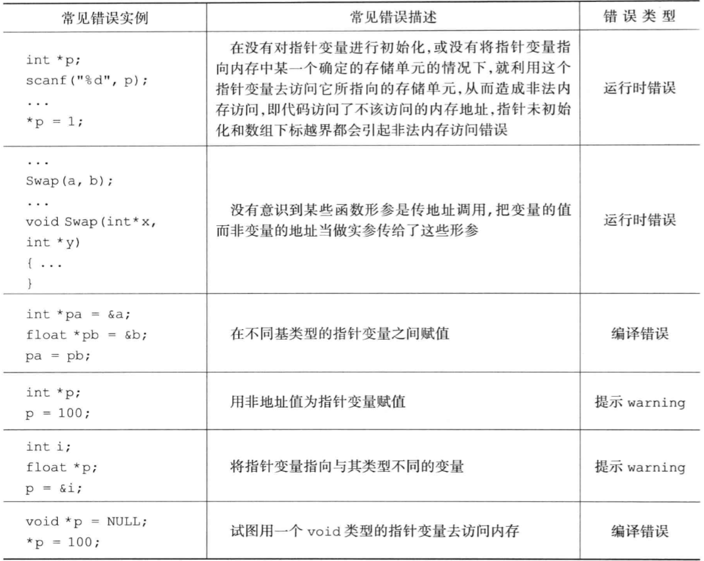

# 数组和指针

## 数组

__二维数组的初始化__

可以按元素初始化也可以按行初始化：

```c
short matrix1[2][3] = { 1,2,3,4,5,6};
short matrix2[2][3] = {{1,2,3}, {4,5,6}};
```

__数组作为参数__

```c
float GetAverage(float score[], int n) {
    if(n < 0) return -1;
    float sum = 0;
    for(int i = 0; i < n; i++) {
        sum += score[i];
    }
    return sum / n
}
// 调用时，传入数组名即可
float average = GetAverage(score, n);
```

> #### Note::数组名代表第一个元素的地址
> 
> 用数组名作为函数的参数，实际上是将数组首地址传给函数，这是出于性能方面的考虑，因为相对于以传值方式将全部数组元素的副本传给函数而言，只复制一个地址值的 __效率自然高很多。__而因为传递的是引用，所以在函数中修改数组参数后，会反映到实际传入的数组上。


---

## 指针

__指针变量__

__存放变量的地址值__ 需要一种特殊类型的变量，这就是指针类型，指针类型的变量，称为 __指针变量__。定义如下：

```
类型关键字 * 指针变量名
```

例如：

```c
int *pa, *pb;
```

表示定义两个 `int` 型的指针变量，可以理解为：`pa` 指向一个整型变量。

__指针运算符`*`__

- 指针运算符用在等号左边表示一个地址：`int *pa = &a`，即 `*` 只是一个 __指针类型说明符__。
- 用在等号右边表示该地址处存储的数据：`int a = *pa`，即 `*` 是一个寻址运算符。

> #### Note::不要忘记给指针变量初始化
> 
> 为了避免指针指向不明，习惯上在定义指针变量的同时将其 __初始化为 NULL__，—— `NULL` 定义在 `stdio.h` 中。


__直接寻址和间接寻址__

- 直接寻址：直接按 __变量名__ 或 __变量地址__ 存取变量内容的访问方式，叫做直接寻址。例如：
    ```c
    scanf("%d", &a); // 地址
    printf("%d", a); // 变量名
    ```

- 间接寻址：通过 __指针变量__ 间接存取它 __所指向的变量__ 的访问方式，叫做间接寻址——先通过指针变量 `pa` 获取变量 `a` 的地址值，然后再到这个地址中访问变量 `a`。


__按值引用和按地址引用__

对普通变量的引用是按值引用，对指针变量是按地址引用。按地址引用可以改变实参的值。

```c
int Func(int *x) { ... } // 定义
int result = Func(&a); // 调用
```

在这里，将函数的形参声明为指针类型，就意味着函数接收的参数只能是一个地址值。

交换两个变量的值：
```c
void Swap(int *pa, int *pb) {
    int temp = *pa;
    *pb = *pa;
    *pa = temp;
}
```

__函数指针__

函数指针主要用来提高程序通用性，减少重复代码。

例如要实现一个通用排序函数，能根据用户选择进行升序或降序排列，可以用函数指针来指向升序或降序函数：

```c
// 函数声明
void Sort(int a[], int n, int (*compare)(int a, int b));
int Ascending(int a, int b);
int Descending(int a, int b);

int main() {
    // ...
    if(order == 1) {
        Sort(score, n, Ascending); // 函数指针指向 Ascending 函数
    } else {
        Sort(score, n, Descending); // 指向 Descending 函数
    }
}

void Sort(int a[], int n, int (*compare)(int a, int b)) {
    for(int i = 0; i < n-1; i++) {
        int k = i;
        for(j = i+1; j < n; j++) 
            if((*compare)(a[j],a[k])) k = j; // 调用所指函数
        if(k!=i) Swap(&a[k],&a[i]);
    }
}

int Ascending(int a, int b) { return a<b; }
```
`Sort` 函数是一个通用排序函数，可升序可降序，因为其中定义了形参：`int (*compare)(int a, int b)`。就像通过一个指向变量的指针去访问它所指向的变量的值一样，这里是 __通过一个指向函数的指针去调用它所指向的函数__。形参指向的函数的调用方式为：`(*compare)[a[j], a[k]]`。

__常见错误__

